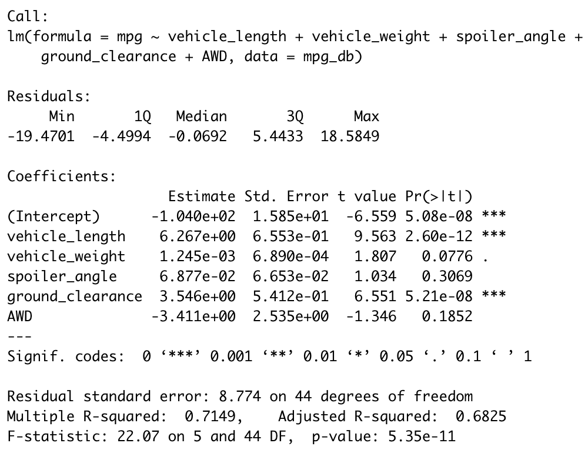
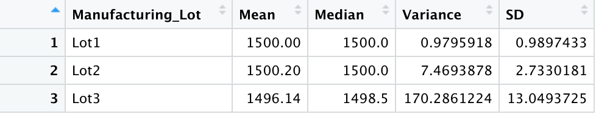
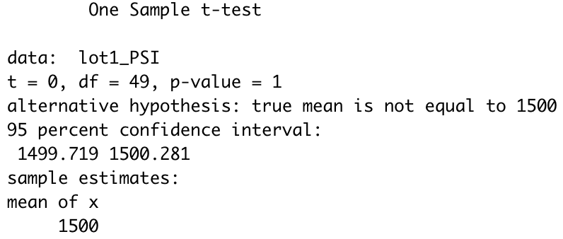
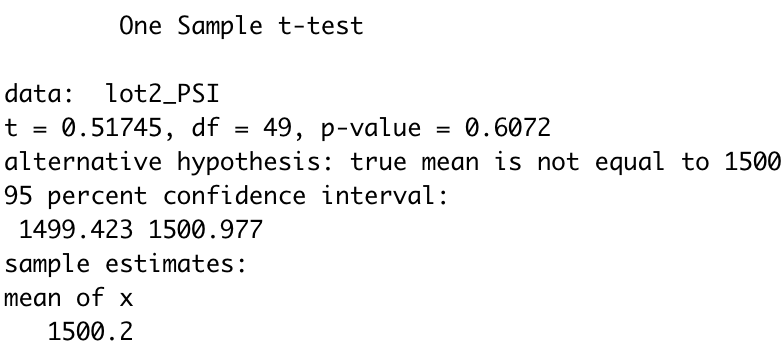
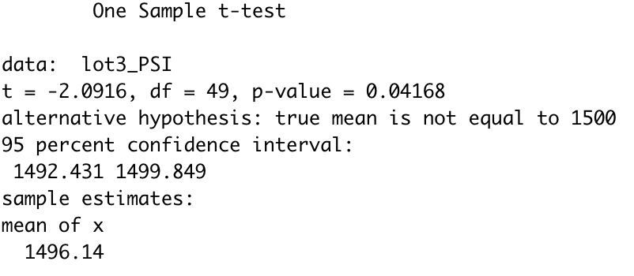

# MechaCar_Statistical_Analysis
## Linear Regression to Predict MPG
There are a number of known influencing variables on a given vehicle's MPG rating--but which variables **really** matter? A multiple linear regression model was chosen to analyze the impact of 5 variables from a set of MechaCar data. The analysis takes into account the following variables. 
* Vehicle Length
* Vehicle Weight
* Angle of the spoiler
* Ground Clearance
* AWD status (see note at end of section)

Below are the results and model of the multiple regression.   

    

### Significant (Non-random) Influencing Variables
There are two clear variables that had non-random influence: vehicle length (p<0.0001) and ground clearance (p<0.0001) A third, possibly non-random, variable was vehicle weight. Further sampling is recommended to confirm its influence is non-random. 
### Interpreting Slope and P-value
According to the F-statistic of 22.07 on the provided degrees of freedom, the p-value of the test is less than 0.0001. Therefore, we reject the null hypothesis that the slope of the regression model is 0; that is, there is a statistically significant correlation between the variables listed an the calculation of MPG rating. 
### Fit of the Model
There is some over-fitting present in the model. There are clearly 2, quite possibly 3, variables whose effects on the model are random. While further testing might indicate that vehicle weight has a significant impact on MPG, currently the over-fitted model may not generalize well to predicting or describing the MPG rating of vehicles beyond our sampled data.

Note: AWD is a nominal variable and was suspect in the use of the regression. The analysis predictably revealed that it did not have a significant influence on MPG. Moreover, out of curiosity, I filtered the data by AWD into two equal groups of size 25. Then, I confirmed via the Shapiro-Wilk test that both groups' MPG ratings were approximately normal. Comparing the sample means of AWD vehicles against non AWD with a 2-sample t test revealed that there was not a statistically significant difference (p=0.32) between the means.

## Summary Statistics on Suspension Coils
Quality control requires that a given lot of suspension coils maintains a variance no greater than 100 PSI. Overall,summary statistics on the total set of suspension coils meets this threshold.  

    

However, further analyzing the separate lots within the total sample yield different results. According to analysis of these lots, while lots 1 and 2 adhere to this condition, lot 3 does not. 

    

## T-Tests on Suspension Coils
Quality assuarance sets the benchmark for mean PSI to be 1500 for the suspension coils. Given that lot 3 coils do not meet the constraints for variance, follow up testing was conducted to confirm which lots met the 1500 PSI mean. The table below depicts the results of the t tests for each lot. 

<table style="width=100px">
    <tr>
        <th style="width=33.3px"> Lot 1 Test</th>
        <th stlye="width=33.3px"> Lot 2 Test</th>
        <th style="width=33.4px"> Lot 3 Test</th>
    </tr>
    <tr>
        <td> </td>
        <td> </td>
        <td> </td>
    </tr>
    <tr>
        <td> Given that lot 1 had mean of 1500, it makes sense that the p-value here is 1. In other words, the null hypothesis that the sample mean is equal to 1500 is not rejected. </td>
        <td> Similarly, the sample mean is very close to 1500 (1500.2), it is no surprise the p-value is 0.61. Again, no significant statistical difference in mean to 1500. </td>
        <td> While the sample mean is 1496.14 may not seem very far off 1500, recall that the variance of lot 3 is much larger than the other lots. P-value is 0.042, thus we reject the null and conclude the mean is significantly different from the benchmark of 1500 PSI.</td>
    </tr>
</table>
