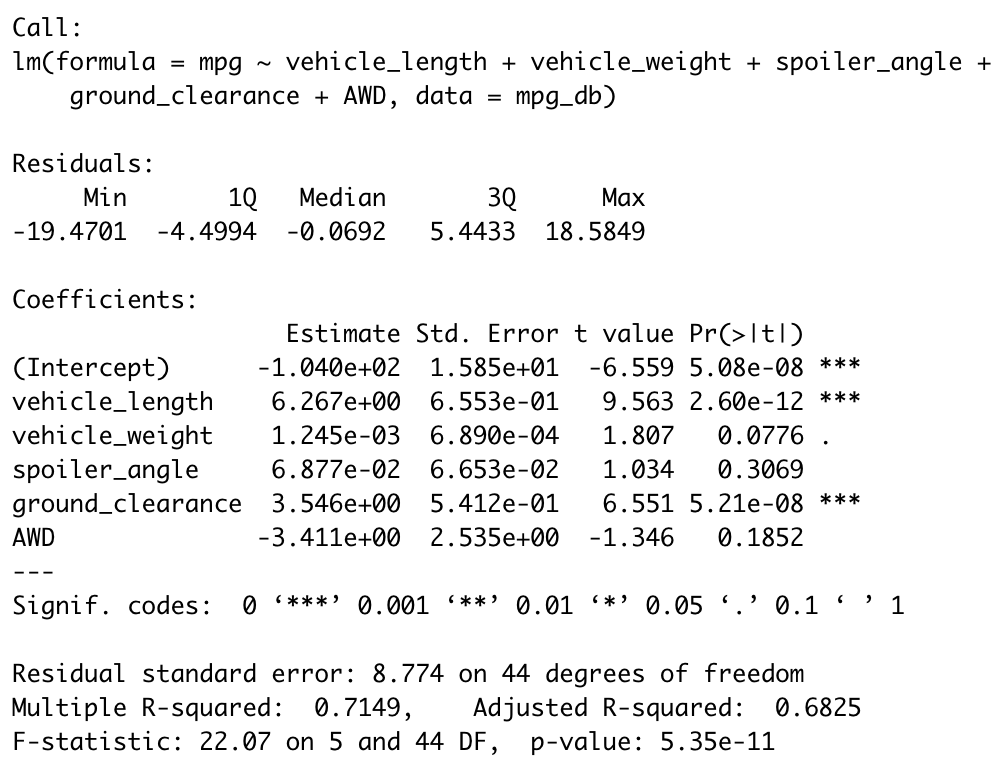

# MechaCar_Statistical_Analysis
## Linear Regression to Predict MPG
There are a number of known influencing variables on a given vehicle's MPG rating--but which variables **really** matter? A multiple linear regression model was chosen to analyze the impact of 5 variables from a set of MechaCar data. The analysis takes into account the following variables. 
* Vehicle Length
* Vehicle Weight
* Angle of the spoiler
* Ground Clearance
* AWD status (see note at end of section)

Below are the results and model of the multiple regression.   

    

Note: AWD is a nominal variable and was suspect in the use of the regression. The analysis predictably revealed that it did not have a significant influence on MPG. Moreover, out of curiosity, I filtered the data by AWD into two equal groups of size 25. Then, I confirmed via the Shapiro-Wilk test that both groups' MPG ratings were approximately normal. Comparing the sample means of AWD vehicles against non AWD with a 2-sample t test revealed that there was not a statistically significant difference (p=0.32) between the means.