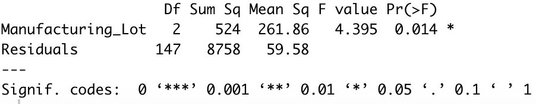
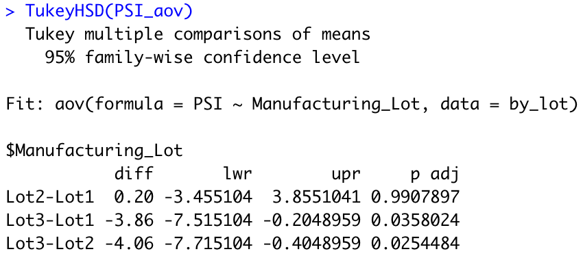

# MechaCar_Statistical_Analysis
## Linear Regression to Predict MPG
There are a number of known influencing variables on a given vehicle's MPG rating--but which variables **really** matter? A multiple linear regression model was chosen to analyze the impact of 5 variables from a set of MechaCar data. The analysis takes into account the following variables. 
* Vehicle Length
* Vehicle Weight
* Angle of the spoiler
* Ground Clearance
* AWD status (see note at end of section)

Below are the results and model of the multiple regression.   

    

### Significant (Non-random) Influencing Variables
There are two clear variables that had non-random influence: vehicle length (p<0.0001) and ground clearance (p<0.0001) A third, possibly non-random, variable was vehicle weight. Further sampling is recommended to confirm its influence is non-random. 
### Interpreting Slope and P-value
According to the F-statistic of 22.07 on the provided degrees of freedom, the p-value of the test is less than 0.0001. Therefore, we reject the null hypothesis that the slope of the regression model is 0; that is, there is a statistically significant correlation between the variables listed an the calculation of MPG rating. 
### Fit of the Model
There is some over-fitting present in the model. There are clearly 2, quite possibly 3, variables whose effects on the model are random. While further testing might indicate that vehicle weight has a significant impact on MPG, currently the over-fitted model may not generalize well to predicting or describing the MPG rating of vehicles beyond our sampled data.

Note: AWD is a nominal variable and was suspect in the use of the regression. The analysis predictably revealed that it did not have a significant influence on MPG. Moreover, out of curiosity, I filtered the data by AWD into two equal groups of size 25. Then, I confirmed via the Shapiro-Wilk test that both groups' MPG ratings were approximately normal. Comparing the sample means of AWD vehicles against non AWD with a 2-sample t test revealed that there was not a statistically significant difference (p=0.32) between the means.

## Summary Statistics on Suspension Coils
Quality control requires that a given lot of suspension coils maintains a variance no greater than 100 PSI. Overall,summary statistics on the total set of suspension coils meets this threshold.  

    

However, further analyzing the separate lots within the total sample yield different results. According to analysis of these lots, while lots 1 and 2 adhere to this condition, lot 3 does not. 

    

## T-Tests on Suspension Coils
Quality assuarance sets the benchmark for mean PSI to be 1500 for the suspension coils. Given that lot 3 coils do not meet the constraints for variance, follow up testing was conducted to confirm which lots met the 1500 PSI mean. The table below depicts the results of the t tests for each lot. 

<table style="width: 100px">
    <tr>
        <th> Lot 1 Test</th>
        <th> Lot 2 Test</th>
        <th> Lot 3 Test</th>
    </tr>
    <tr>
        <td> </td>
        <td> </td>
        <td> </td>
    </tr>
    <tr>
        <td> Given that lot 1 had mean of 1500, it makes sense that the p-value here is 1. In other words, the null hypothesis that the sample mean is equal to 1500 is not rejected. </td>
        <td> Similarly, the sample mean is very close to 1500 (1500.2), it is no surprise the p-value is 0.61. Again, no significant statistical difference in mean to 1500. </td>
        <td> While the sample mean is 1496.14 may not seem very far off 1500, recall that the variance of lot 3 is much larger than the other lots. P-value is 0.042, thus we reject the null and conclude the mean is significantly different from the benchmark of 1500 PSI.</td>
    </tr>
</table>

To further clarify or confirm the differences between the lots of suspension coils, below shows the results of 1-way ANOVA and the results of the post-hoc Tukey test for comparisons.  
<table style="width:100px">
    <tr>
        <th> ANOVA Results </th>
        <th> Tukey's Test </th>
    </tr>
    <tr>
        <td>  </td>
        <td> </td>
    </tr>
    <tr>
        <td> The p-value of 0.014 indicates at any typical level of significance greater than 0.01 that there is a statistically significant difference in means of the 3 lots. </td>
        <td> The Tukey's comparisons test confirms that the difference therein resides in lot 3. With the previous analyses, this is not surprising. </td>
    </tr>
</table>

## Study Design: MechaCar vs Competition
According to "10 Steps to Finding the Right Car for You" from Edmunds.com, some of the most pressing issues when considering a new vehicle come down to the following: feul economy, cost, maintenance costs, safety ratings, and where you will be driving your new vehicle. MechaCars business is of a scope similar to leading competitors such as Ford and GM (GM having sold nearly 500k cars in 2020 second quarter--a decline due in part to the pandemic). In order to compare MechaCar vehicles to those of it's top competitors, I recommend examining the testing records for both MechaCar's new models and the top performing models from Ford, GM, Dodge, Nissan, and Toyota. Using a randomized block design, the vehicles would be put into factor groups based on make and class with 6 treatment levels of mileage and location tested (i.e. tested over combinations of short, moderate, or long durations, and in city or out of city).    
From there, the following metrics can be gathered and analyzed in order to determine MechaCar's status relative to top competitors. 
- *Feul Economy:* mileage (MPG) [The treatment groups will clarify HWY vs City]
- *Cost:* Expected base market value + a decided upon number of ammenities (are vehicles assumed to all come with the same base level products, i.e. power windows, heated seats, etc.)
- *Expected Maintenance Costs:* Can be provided through analyzing historical costs of a given make's similar/previous models
- *Safety Ratings:* use accepted metric, such as JD Power rating

Several levels of analysis could then be performed depending on interest and value of the analysis. Within treatment levels, and assuming normality, ANOVA tests and Tukey's comparisons can determine differences across factor levels and provide an indication as to the leader in the above metrics per relative group. For non parametric data, the Kruskal-Wallis test can provide similar insights into a starting place for comparing differences within treatment levels. 